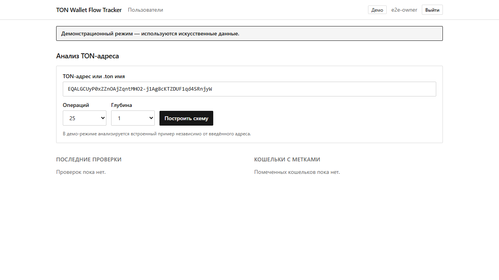
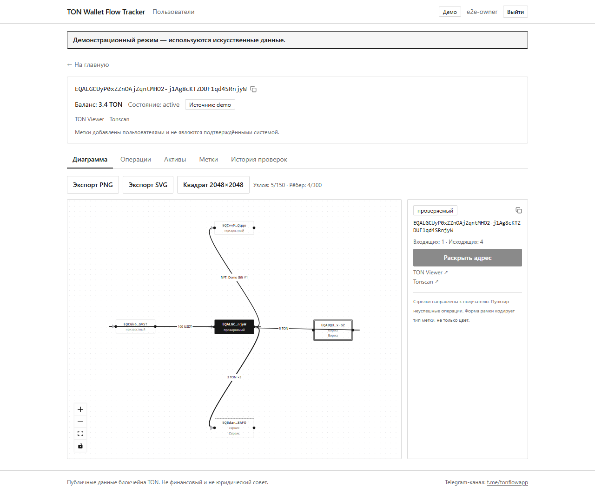
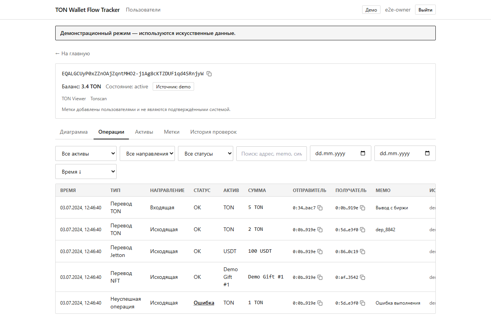

English | [Русский](README.ru.md)

# TON Wallet Flow Tracker

TON Wallet Flow Tracker loads public on-chain activity for a TON address, normalizes it into a single event model, and draws the transfers as an interactive graph. It is a private, authenticated web app for a small team, and it is open source under Apache-2.0.

It works only with public blockchain data. It never asks for seed phrases, private keys, or wallet connections, it does not move funds, and it does not claim to prove who owns an address.

## Features

- **Address input** — friendly bounceable (`EQ…`), friendly non-bounceable (`UQ…`), raw (`0:…`), and `.ton` DNS names. Every input is normalized to a canonical raw address plus both friendly forms and workchain, with the checksum verified by `@ton/core`.
- **Interactive transfer graph** — the analyzed wallet sits at the center, counterparties around it. Edges point toward the recipient, carry the moved amount (TON, jetton symbol, NFT name, or a grouped `×N` count), get thicker with operation count, and are dashed when every grouped transfer failed. Node border style — not color alone — encodes the node kind.
- **Node expansion** — click a counterparty to load its transfers, up to a configurable depth (default cap 3). A visited set prevents cycles, and hard caps of 150 nodes / 300 edges stop runaway growth with a visible notice.
- **Operations table** — every normalized action with time, type, direction, status, asset, amount, sender, recipient, memo, and data source. Filter by asset kind / direction / status, free-text search over addresses and memos, date range, sort by time or amount, and client-side paging.
- **Assets tab** — jetton balances and owned NFTs for the address, loaded on demand.
- **User labels** — tag an address (`OWN`, `SAFE`, `UNKNOWN`, `SUSPICIOUS`, `SERVICE`, `EXCHANGE`, `MARKETPLACE`, `OTHER`) with a title and note. Every label view states plainly that labels are user-supplied, not system-confirmed facts. Label changes are written to the audit log.
- **Exports** — the diagram as PNG, SVG, or a square 2048×2048 PNG on a white background, rendered from the live graph.
- **Demo mode** — with `DEMO_MODE=true` the app serves only synthetic fixtures, never touches an external API, and shows a persistent banner. Useful for screenshots, local trials, and end-to-end tests.

## Screenshots

The images below are placeholders captured in demo mode; all data in them is synthetic, not real wallet activity.

| Dashboard | Flow graph | Operations |
|---|---|---|
|  |  |  |

## Architecture

Four layers, kept deliberately separate:

- **Domain** (`src/domain`) — pure, framework-free types and graph math (edge aggregation, node/edge caps, cycle-safe expansion, string sanitization). No React, no I/O.
- **Providers** (`src/server/providers`) — one `BlockchainProvider` interface with two implementations (TonAPI, TON Center) behind an orchestrator, wrapped in a resilient HTTP client (timeout, bounded retries with jitter, `Retry-After`, circuit breaker, TTL cache, concurrency limiter, SSRF host allowlist).
- **Server services** (`src/server`) — analysis, authentication, labels, audit, and rate limiting, on top of Prisma/PostgreSQL.
- **App** (`src/app`, `src/components`) — Next.js App Router. Server components fetch and render; a handful of client components (the React Flow graph, the operations table, the label and asset tabs) handle interaction. Route handlers under `src/app/api` expose the internal endpoints, and `src/middleware.ts` sets a per-request CSP nonce.

See [ARCHITECTURE.md](ARCHITECTURE.md) for the request flow and module map.

## Stack

Next.js 15 (App Router) and React 19 with TypeScript in strict mode, Tailwind CSS for styling, and React Flow (`@xyflow/react`) for the graph. Server state lives in PostgreSQL via Prisma. Passwords are hashed with Argon2id (`@node-rs/argon2`), input is validated with Zod on both the form and the server, and TON address math uses `@ton/core`. `@tanstack/react-query` is present as a dependency, but the app relies on server components plus a small `fetch` helper rather than a client query cache.

## Quick start (Docker)

Prerequisites: Docker with Compose.

```bash
cp .env.example .env
# Fill in TONAPI_API_KEY / TONCENTER_API_KEY and generate the secrets below.
node -e "console.log(require('crypto').randomBytes(48).toString('base64url'))"   # SESSION_SECRET
node -e "console.log(require('crypto').randomBytes(48).toString('base64url'))"   # AUTH_SECRET
node -e "console.log(require('crypto').randomBytes(24).toString('base64url'))"   # POSTGRES_PASSWORD

docker compose up -d --build
```

The app is published on `http://127.0.0.1:8137`; PostgreSQL is internal to the Compose network and is not exposed on the host. Migrations and the seed run on startup. The seed creates the first owner (`jutsu-dev`) with a random temporary password written to `secrets/initial-owner-password`:

```powershell
Get-Content .\secrets\initial-owner-password   # Windows
```
```bash
cat ./secrets/initial-owner-password           # Linux/macOS
```

Log in with that password; you are required to change it before anything else. Put a reverse proxy in front for TLS. Full instructions are in [DEPLOYMENT.md](DEPLOYMENT.md).

To run the interface without any API keys, set `DEMO_MODE=true` and open the app — it serves the built-in synthetic scenario.

## Environment

All configuration is via environment variables. Copy [.env.example](.env.example) to `.env` and fill it in; the file documents every key, including provider URLs and keys, the database URL, the session and auth secrets, analysis limits (per-window analyses, concurrency, source-event and depth caps, node/edge caps), login lockout, and provider/cache tuning. The server validates the environment with Zod at first use and refuses to start with a helpful list of offending keys — it never prints their values.

## Authentication

There is no public registration; accounts are created by an owner. Two roles exist: **OWNER** (manages users and labels, sees the audit trail) and **MEMBER** (analyzes addresses, views operations, creates labels, exports).

Sessions are stored server-side in the database and referenced by an opaque random token held in an `httpOnly` cookie; only the SHA-256 of the token is persisted. Passwords are hashed with Argon2id at the OWASP baseline parameters. A first login with a temporary password forces a password change, which also revokes existing sessions. Login is protected by per-account lockout after repeated failures and by per-IP rate limiting, and password verification runs even for unknown usernames to blunt timing-based user enumeration.

The first owner is created by the database seed with a random password written only to `secrets/initial-owner-password` — it is never printed to logs or the console.

## API providers

TonAPI (`https://tonapi.io`, REST v2) is the primary source; TON Center API v3 (`https://toncenter.com/api/v3`) is the fallback. The orchestrator tries TonAPI first and falls back to TON Center only on transient failures (rate limiting, upstream 5xx, timeouts, network errors, an open circuit); permanent errors such as a bad request or a bad key propagate instead, because a fallback would not help. Every result records which source produced it and whether the response was incomplete.

API keys are read from the server environment and used only in server-side code (`server-only` modules). They are never sent to the browser, embedded in responses, or written to logs. Requests are constrained to an allowlist of the two provider hosts, redirects are refused, and non-HTTPS schemes are rejected.

## Tests

`npm test` runs the Vitest suite (unit tests for address handling, amount formatting, DNS validation, sanitization, graph construction, provider mapping, resilience, rate limiting, and CSRF). A database integration test for authentication and sessions is gated on `DATABASE_URL`: it runs when a Postgres URL is present (locally and in CI) and is skipped otherwise. `npm run test:e2e` runs Playwright against a running instance (demo mode is enough); the browser tests are configured to point at `E2E_BASE_URL`.

```bash
npm test            # unit + (if DATABASE_URL set) integration
npm run typecheck   # tsc --noEmit
npm run lint        # next lint
npm run build       # prisma generate && next build
```

CI needs no real API keys: unit tests use mocked providers and demo fixtures.

## Security

The app validates every server input with Zod, checks authentication and authorization on every protected route, enforces CSRF protection with a double-submit token plus a same-origin check on mutations, and sets a strict Content-Security-Policy with `frame-ancestors 'none'` from middleware. Structured JSON logs redact secret-looking fields and shorten addresses. See [SECURITY.md](SECURITY.md) for the security policy and how to report an issue.

## Limitations

The TON Center fallback classifies only TON transfers; jetton and NFT movements are marked incomplete on that path. Explorer links point at addresses rather than individual transactions because the events feed does not carry per-transaction hashes. The rate limiter is in-process. These and other honest caveats are collected in [LIMITATIONS.md](LIMITATIONS.md).

## Roadmap

Planned work — richer TON Center fallback, an asset-trace mode, an English locale, per-node depth control, saved investigations, and a shared rate-limit store for multi-instance deployments — is tracked in [ROADMAP.md](ROADMAP.md).

## Contributing

Contributions are welcome. See [CONTRIBUTING.md](CONTRIBUTING.md) for setup, the test/lint/typecheck/build gate, and commit conventions, and [CODE_OF_CONDUCT.md](CODE_OF_CONDUCT.md) for community expectations.

## License

Licensed under the Apache License, Version 2.0. See [LICENSE](LICENSE) and [NOTICE](NOTICE).

Copyright (c) 2026 jutsu-dev
