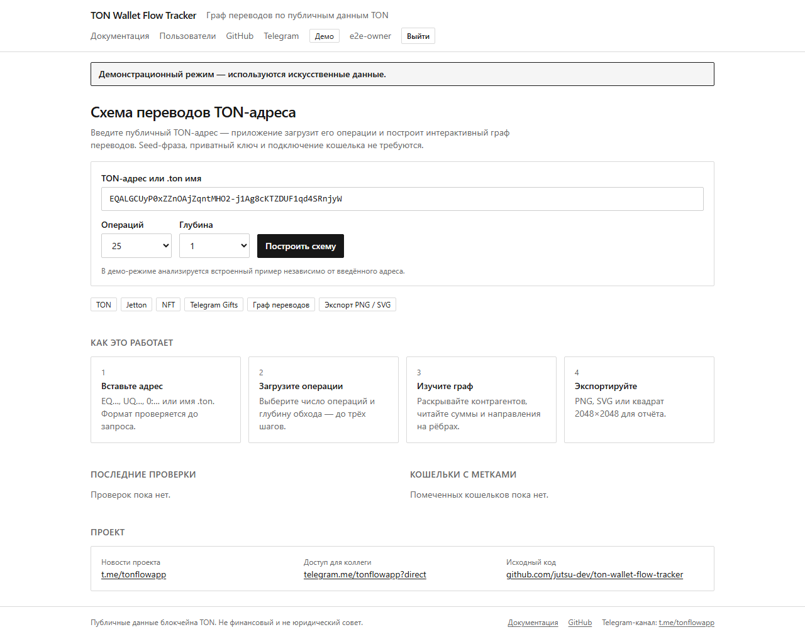
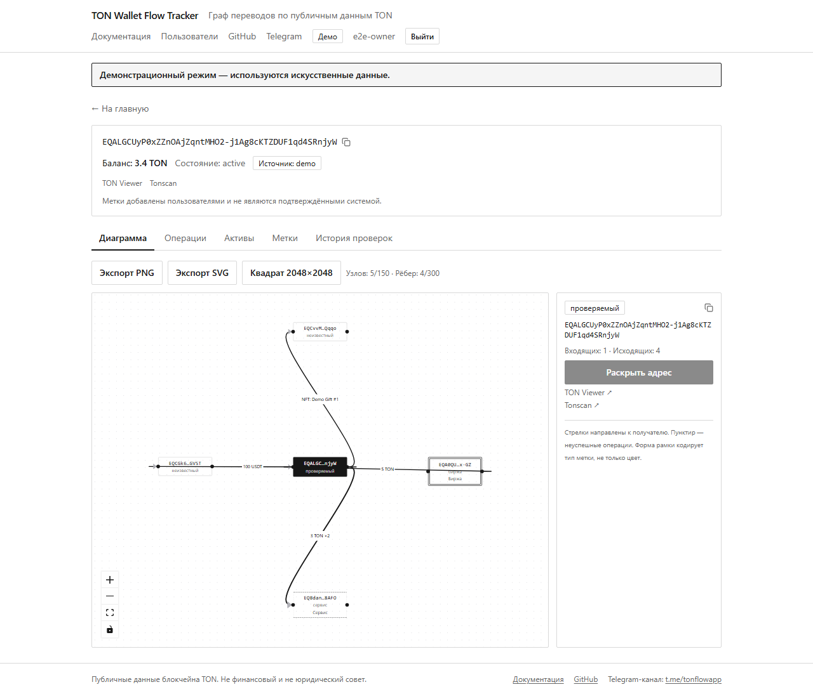
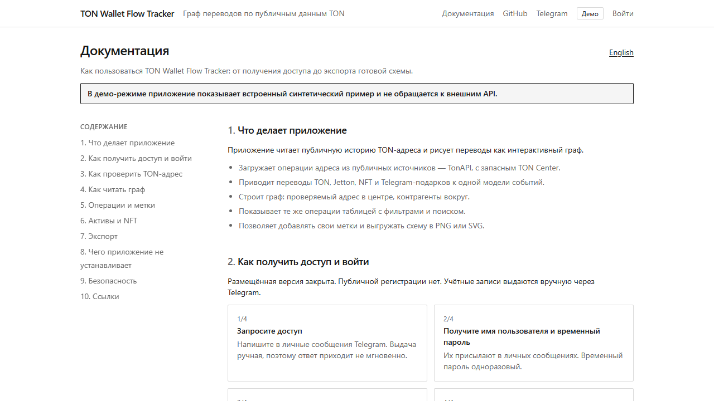
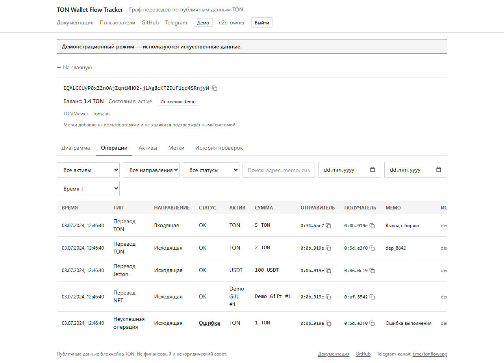
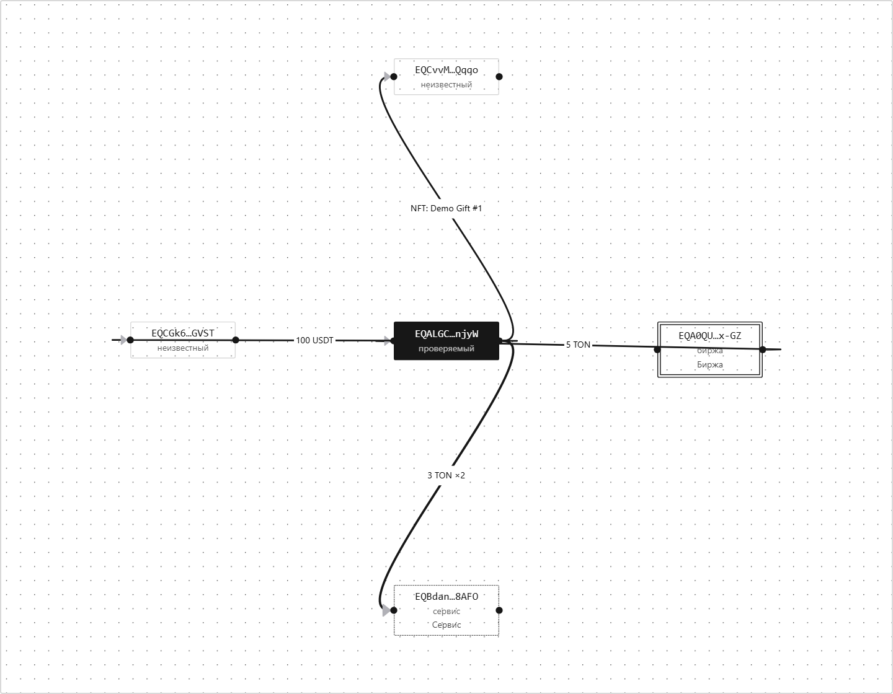

[English](README.md) | [Русский](README.ru.md)

<h1>TON Wallet Flow Tracker</h1>

**Визуальная аналитика публичной активности TON-кошельков.**

TON Wallet Flow Tracker загружает публичную активность TON-аккаунта и рисует переводы как интерактивный граф. Поддерживаются переводы TON, Jetton, NFT и Telegram-подарков — без доступа к кошельку и приватным ключам.

[](https://github.com/jutsu-dev/ton-wallet-flow-tracker/actions/workflows/ci.yml)
[](LICENSE)
[](package.json)
[](package.json)
[](tsconfig.json)
[](docker-compose.yml)

[**Документация**](#карта-документации) · [**Быстрый старт**](#быстрый-старт-docker) · [**Безопасность**](SECURITY.ru.md) · [**Telegram-канал**](https://t.me/tonflowapp) · [**Получить доступ**](https://telegram.me/tonflowapp?direct)

> **Размещённая версия закрыта. Публичной регистрации нет. Учётные записи выдаются вручную через Telegram.**
>
> Telegram-канал: <https://t.me/tonflowapp> · Получить имя пользователя и временный пароль: <https://telegram.me/tonflowapp?direct>

---







<sub>Руководство пользователя открыто — учётная запись не нужна, поэтому посмотреть, что умеет инструмент, можно ещё до запроса доступа.</sub>

<details>
<summary><b>Ещё скриншоты</b> — таблица операций и результат экспорта</summary>

<br>

**Таблица операций** — все нормализованные действия с фильтрами по активу, направлению и статусу и поиском по адресам и комментариям.



**Результат экспорта** — настоящий PNG, который отдаёт приложение, а не его имитация.



</details>

<sub>Все изображения сняты в демо-режиме. Все адреса, суммы и метки на них синтетические.</sub>

## Что приложение делает

- Загружает публичную историю адреса через **TonAPI**, с запасным источником **TON Center**, и приводит переводы TON, Jetton, NFT и Telegram-подарков к единой модели событий.
- Строит **интерактивный граф**: проверяемый адрес в центре, контрагенты вокруг. Стрелка направлена к получателю, подпись на ребре несёт сумму, толщина растёт с числом операций, а пунктир означает, что все сгруппированные переводы завершились неуспешно.
- **Раскрывает контрагентов** по клику, до глубины 3, с защитой от циклов и жёсткими лимитами: 150 узлов и 300 рёбер.
- Показывает все операции **таблицей с фильтрами** — актив, направление, статус, поиск по адресам и комментариям, диапазон дат, сортировка, постраничный вывод.
- По запросу отдаёт **балансы Jetton и список NFT** адреса.
- Позволяет ставить **пользовательские метки**, которые всегда подписаны как пользовательские, а не как подтверждённый факт; изменения попадают в журнал аудита.
- **Экспортирует** схему в PNG, SVG или квадратный PNG 2048×2048.
- Содержит **демо-режим**: только синтетические данные, без обращений к внешним API.

## Чего приложение не делает

- Никогда не запрашивает **seed-фразу или приватный ключ** и не использует TonConnect или подключение кошелька.
- Никогда не **подписывает и не отправляет транзакции** и не распоряжается средствами.
- Не **определяет владельца адреса** и не связывает адрес с человеком или компанией.
- Не **обвиняет адреса в мошенничестве** и не выставляет им оценки автоматически.
- Не является **финансовым или юридическим советом** и не заменяет расследование.
- Не имеет **публичной регистрации** — учётные записи существуют только потому, что их создал владелец.

## Быстрый старт (Docker)

Требуются Docker с Compose, ключ TonAPI и ключ TON Center. Чтобы посмотреть интерфейс вообще без ключей, поставьте `DEMO_MODE=true` и сразу переходите к `docker compose up`.

```bash
git clone https://github.com/jutsu-dev/ton-wallet-flow-tracker.git
cd ton-wallet-flow-tracker
cp .env.example .env          # Windows PowerShell: Copy-Item .env.example .env
```

Заполните `TONAPI_API_KEY` и `TONCENTER_API_KEY`, затем сгенерируйте три секрета:

```bash
node -e "console.log(require('crypto').randomBytes(24).toString('base64url'))"   # POSTGRES_PASSWORD
node -e "console.log(require('crypto').randomBytes(48).toString('base64url'))"   # SESSION_SECRET
node -e "console.log(require('crypto').randomBytes(48).toString('base64url'))"   # AUTH_SECRET
```

Приведите `DATABASE_URL` в соответствие со сгенерированным паролем и запускайте:

```bash
docker compose up -d --build
```

Приложение слушает `http://127.0.0.1:8137`. PostgreSQL доступен только внутри сети Compose и наружу не публикуется. Миграции и seed выполняются при старте; seed создаёт первого владельца со случайным временным паролем в файле `secrets/initial-owner-password`:

```bash
cat ./secrets/initial-owner-password            # Linux/macOS
```
```powershell
Get-Content .\secrets\initial-owner-password    # Windows
```

Войдите с этим паролем — приложение сразу потребует его сменить. Для TLS поставьте впереди reverse proxy.

Пошаговая версия — с бэкапами, обновлением и разбором проблем — в **[TUTORIAL.ru.md](TUTORIAL.ru.md)**.

## Подробное руководство

[TUTORIAL.ru.md](TUTORIAL.ru.md) проводит через первый запуск целиком: развёртывание в Docker, локальная разработка без Docker, реальные подводные камни Windows, с которыми проект столкнулся, и настройка Linux VPS.

## Архитектура

Четыре намеренно разделённых слоя:

- **Domain** (`src/domain`) — чистые типы и математика графа: агрегация рёбер, лимиты узлов и рёбер, раскрытие без циклов, санитизация. Без React и без ввода-вывода.
- **Providers** (`src/server/providers`) — один интерфейс `BlockchainProvider`, две реализации (TonAPI, TON Center) за оркестратором, поверх устойчивого HTTP-клиента: таймаут, ограниченные повторы с джиттером, `Retry-After`, circuit breaker, TTL-кэш, ограничитель конкурентности, allowlist хостов против SSRF.
- **Server services** (`src/server`) — анализ, аутентификация, метки, аудит и ограничение частоты поверх Prisma/PostgreSQL.
- **App** (`src/app`, `src/components`) — Next.js App Router. Серверные компоненты загружают и рендерят, несколько клиентских отвечают за интерактив. `src/middleware.ts` выставляет CSP-nonce на каждый запрос.

Полный поток запроса и карта модулей: [ARCHITECTURE.ru.md](ARCHITECTURE.ru.md). Внутренние эндпоинты: [API.ru.md](API.ru.md).

**Стек** — Next.js 15 (App Router), React 19, TypeScript в строгом режиме, Tailwind CSS, React Flow (`@xyflow/react`), PostgreSQL через Prisma, Argon2id (`@node-rs/argon2`), Zod, `@ton/core`.

## Модель безопасности

- **Публичной регистрации нет.** Две роли: OWNER (управляет пользователями и метками, читает журнал аудита) и MEMBER (анализирует, ставит метки, экспортирует).
- **Серверные сессии** по непрозрачному случайному токену в cookie; в базе хранится только SHA-256 токена. Пароли — Argon2id с параметрами по базовой рекомендации OWASP. Временный пароль обязывает сменить его при первом входе, и смена завершает все прежние сессии.
- **Защита входа** — блокировка учётной записи после серии неудач и ограничение по IP; проверка пароля выполняется и для несуществующих имён, чтобы затруднить перебор пользователей по времени ответа.
- **Каждый серверный ввод проверяется Zod**; аутентификация и авторизация проверяются на каждом защищённом маршруте; CSRF — двойная отправка токена плюс проверка источника на изменяющих запросах.
- **Строгий CSP** с nonce на каждый запрос и `frame-ancestors 'none'`.
- **API-ключи остаются на сервере**, в модулях `server-only`: они не попадают в браузер, в ответы и в логи. Исходящие запросы ограничены allowlist из двух хостов провайдеров, редиректы запрещены, не-HTTPS схемы отклоняются.
- **Структурированные логи** маскируют поля, похожие на секреты, и сокращают адреса.

Политика и порядок сообщения об уязвимости: [SECURITY.ru.md](SECURITY.ru.md). Активы, угрозы и меры: [THREAT_MODEL.ru.md](THREAT_MODEL.ru.md).

## Разработка

```bash
npm ci
cp .env.example .env          # DATABASE_URL — на локальный PostgreSQL
npx prisma migrate deploy
npm run db:seed
npm run dev                   # http://localhost:3000
```

Подробности и соглашения: [CONTRIBUTING.ru.md](CONTRIBUTING.ru.md).

## Тесты

```bash
npm run lint          # next lint
npm run typecheck     # tsc --noEmit
npm test              # Vitest: unit + интеграционные (интеграционным нужен DATABASE_URL)
npm run test:e2e      # Playwright против запущенного инстанса
npm run build         # prisma generate && next build
```

Интеграционный тест аутентификации и сессий завязан на `DATABASE_URL` и без него пропускается. Перед Playwright засейте тестовые учётные записи (`npx tsx e2e/seed-users.ts` с тем же `DATABASE_URL`) и поднимите **свежий** инстанс: число входов ограничено по IP клиента и хранится в памяти (`LOGIN_MAX_ATTEMPTS * 3` за окно блокировки), а все тесты входят с одного адреса — поэтому второй прогон внутри окна исчерпывает лимит и падает на входе. Перезапуск инстанса сбрасывает счётчик, повторный seed — нет.

Реальные API-ключи для CI не нужны: юнит-тесты используют мок-провайдеры и демо-данные.

## Развёртывание

Приложение должно слушать только `127.0.0.1`, а TLS терминирует reverse proxy впереди; PostgreSQL наружу публиковать нельзя. Бэкапы, восстановление, обновление и действия при инцидентах: [DEPLOYMENT.ru.md](DEPLOYMENT.ru.md) и [OPERATIONS.ru.md](OPERATIONS.ru.md).

## Карта документации

| Документ | О чём |
|---|---|
| [TUTORIAL.ru.md](TUTORIAL.ru.md) | Пошаговый первый запуск: Docker, локальная разработка, Windows, Linux VPS |
| [PROJECT_OVERVIEW.ru.md](PROJECT_OVERVIEW.ru.md) | Что это за проект и зачем он нужен |
| [ARCHITECTURE.ru.md](ARCHITECTURE.ru.md) | Слои, поток запроса, карта модулей |
| [API.ru.md](API.ru.md) | Внутренние HTTP-эндпоинты |
| [SECURITY.ru.md](SECURITY.ru.md) | Политика безопасности и сообщение об уязвимости |
| [THREAT_MODEL.ru.md](THREAT_MODEL.ru.md) | Активы, угрозы, меры |
| [DEPLOYMENT.ru.md](DEPLOYMENT.ru.md) | Развёртывание в продакшене |
| [OPERATIONS.ru.md](OPERATIONS.ru.md) | Бэкапы, восстановление, регулярные операции |
| [LIMITATIONS.ru.md](LIMITATIONS.ru.md) | Известные ограничения и честные оговорки |
| [ROADMAP.ru.md](ROADMAP.ru.md) | Планы |
| [CONTRIBUTING.ru.md](CONTRIBUTING.ru.md) | Настройка, проверки, соглашения по коммитам |
| [CODE_OF_CONDUCT.ru.md](CODE_OF_CONDUCT.ru.md) | Правила сообщества |
| [SPEC.ru.md](SPEC.ru.md) | Исходная спецификация |
| [DECISIONS.ru.md](DECISIONS.ru.md) | Инженерные решения и компромиссы |
| [REPOSITORY_AUDIT.ru.md](REPOSITORY_AUDIT.ru.md) | Каждый отслеживаемый файл и почему он публичный |
| [CHANGELOG.ru.md](CHANGELOG.ru.md) | История изменений |
| [THIRD_PARTY_NOTICES.ru.md](THIRD_PARTY_NOTICES.ru.md) | Лицензии зависимостей |
| [PUBLICATION_CHECKLIST.ru.md](PUBLICATION_CHECKLIST.ru.md) | Состояние проверок перед публикацией |

У каждого документа есть английский оригинал в файле без суффикса `.ru`. Пользовательское руководство внутри приложения доступно по адресу `/docs` на русском и английском и не требует учётной записи — можно посмотреть, что умеет инструмент, ещё до запроса доступа.

## Ограничения

Запасной источник TON Center распознаёт только переводы TON — Jetton и NFT на этом пути помечаются как неполные данные. Ссылки на обозреватели ведут на адрес, а не на конкретную транзакцию, потому что лента событий не содержит хэшей отдельных транзакций. Ограничитель частоты работает в памяти процесса, поэтому многоинстансному развёртыванию понадобится общее хранилище. Полный список — в [LIMITATIONS.ru.md](LIMITATIONS.ru.md).

## Планы

Более полный разбор данных TON Center, отдельный экран трассировки активов, полная английская локализация, глубина обхода для отдельного узла, сохранённые расследования и общее хранилище лимитов — в [ROADMAP.ru.md](ROADMAP.ru.md).

## Участие

Вклад приветствуется. См. [CONTRIBUTING.ru.md](CONTRIBUTING.ru.md) — настройка, обязательные проверки (lint/typecheck/тесты/сборка) и соглашения по коммитам, и [CODE_OF_CONDUCT.ru.md](CODE_OF_CONDUCT.ru.md) — правила сообщества.

## Telegram

- Канал проекта — новости и заметки о релизах: <https://t.me/tonflowapp>
- Запросить имя пользователя и временный пароль к размещённой версии: <https://telegram.me/tonflowapp?direct>

Доступ выдаётся вручную в личных сообщениях Telegram. Публичной регистрации и автоматической выдачи нет.

## Лицензия

Проект распространяется по лицензии Apache License, Version 2.0 — см. [LICENSE](LICENSE) и [NOTICE](NOTICE). Неофициальное пояснение на русском — в [LICENSE.ru.md](LICENSE.ru.md); юридически действующим является английский текст [LICENSE](LICENSE).

Copyright (c) 2026 jutsu-dev
